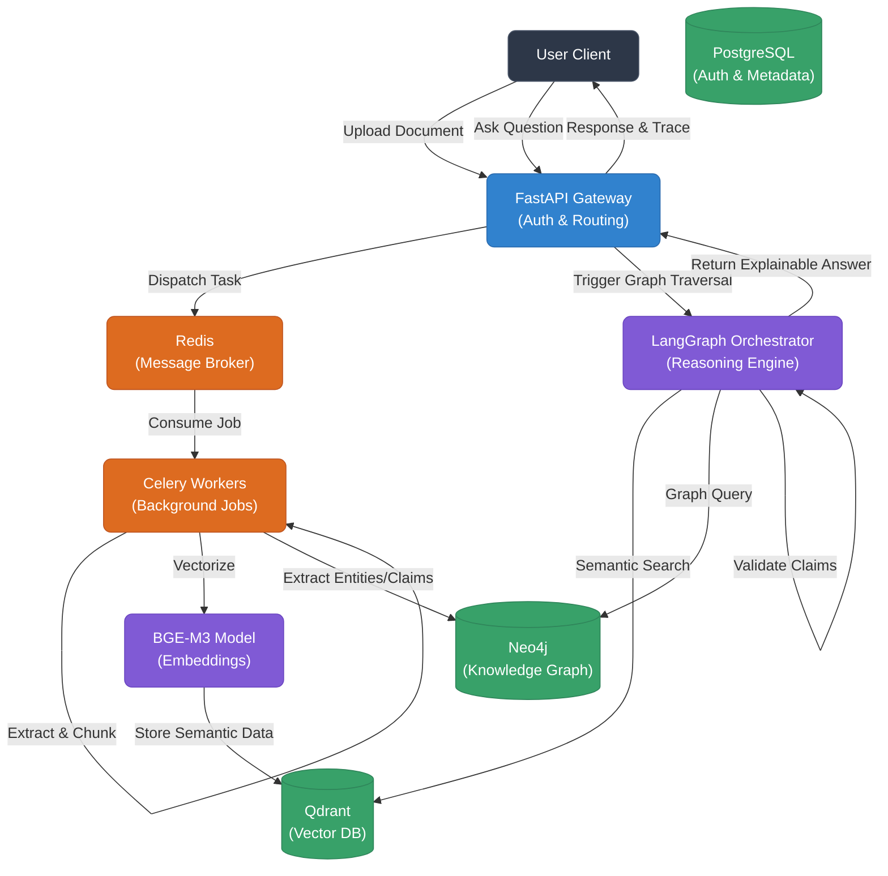

# 🏗️ Blueprints & Bugs: Designing SovereignRAG V2

*Here is the synthesized content for your newsletter, structured to highlight why standard RAG fails, how our architecture solves it, and the deep-dive technical decisions we made.*

---

## 📸 The Architecture Flow (Mermaid Diagram)
*Copy this code block directly into any Mermaid-compatible viewer (or LinkedIn's image generator) to get a beautiful architectural diagram of our system.*

---

## 📝 Newsletter Content Draft

**Headline: Why Standard RAG is Broken, and How We're Fixing It with Graph Analytics.**
Welcome back to *Blueprints & Bugs*, where we tear down complex system architectures to see why they tick—and more importantly, why they fail. Today, we are dissecting an internal build: **SovereignRAG V2**, an open-source, production-ready Agentic GraphRAG engine.

### The Bug: The Hallucination Loop of Standard RAG
If you’ve built a standard Retrieval-Augmented Generation (RAG) system, you know the drill: chunk text, embed it, dump it into a vector database, and perform a cosine-similarity search when a user asks a question. 

*Why it fails:* Vector search relies purely on semantic proximity. It has no structural understanding of reality. If you ask, "Did Company A acquire Company B?", a standard vector lookup pulls any chunk containing those companies and the word "acquire." The LLM synthesizes an answer, often hallucinating timelines or confusing who acquired whom, because semantic similarity cannot encode *directional logic*.

### The Blueprint: SovereignRAG V2
To fix the structural blindness of standard RAG, we are building a multi-database, asynchronous graph ingestion engine. We aren’t just mapping *similarity*; we are mapping *facts*.

Here is the architectural breakdown and the technical decisions we made to make it production-ready:

#### 1. The Async Ingestion Pipeline (FastAPI + Celery + Redis)
Data ingestion cannot block the main thread. 
* **The Decision:** We built a high-throughput API gateway in **FastAPI**. When a user uploads a heavy PDF, the gateway creates a job record in **PostgreSQL** and immediately drops the file to a **Redis** message broker. **Celery** background workers pick up the job, extracting text via `PyMuPDF`, chunking it, and routing it to our storage engines without the user waiting.

#### 2. The Vector Layer (Qdrant & BGE-M3)
* **The Decision (ADR-001 & 005):** We chose **Qdrant** written in Rust over FAISS or Pinecone. Why? Because production RAG requires heavy payload metadata filtering at massive scale, which Qdrant excels at natively. We paired this with the open-weight **BAAI/BGE-M3** model for our embeddings. It handles 100+ languages and outputs extremely dense 1024-dimension vectors, eliminating the need to pay OpenAI for basic embedding generation.

#### 3. The Graph State Layer (Neo4j)
* **The Decision:** This is where standard RAG fails and SovereignRAG succeeds. Alongside our vector storage, we use **Neo4j** to maintain a strict Knowledge Graph. During ingestion, the system extracts concrete entities (People, Orgs, Policies) and relationships (`ACQUIRED_BY`, `CONTRADICTS`). Neo4j guarantees strict tracking of conversational state and facts, providing the structural logic that semantic embeddings lack.

#### 4. The Agentic Reasoning Engine (LangGraph)
* **The Decision (ADR-002):** We abandoned linear frameworks like simple LangChain or LlamaIndex in favor of **LangGraph**. Graph reasoning requires cycles. Before answering a user, our agent hits a `query_vector` node, loops back to evaluate the evidence, triggers a `traverse_graph` node in Neo4j to verify the relationships, and finally passes through a strict validation node. LangGraph allows us to define this exact, deterministic cyclic flow, preventing the LLM from going rogue.

#### 5. Strict Hybrid Validation
* **The Decision (ADR-003):** To stop hallucinations, we don't just rely on the LLM to get it right. Before the final generation, the system runs a pre-filter algorithm across the vector and graph data. If the LLM generates a claim that isn't hard-linked to an entity edge in Neo4j, the system rejects it and re-rolls. We prioritize accuracy over speed.

### The Takeaway
If your data has rules, relationships, and hard boundaries, vector proximity alone is not enough. You need the semantic fluidity of vectors chained to the unforgiving strictness of a graph database.

*What are your thoughts on pairing Graph Databases with Vector Stores? Have you hit the "semantic ceiling" in your own RAG apps? Let me know in the comments!*
